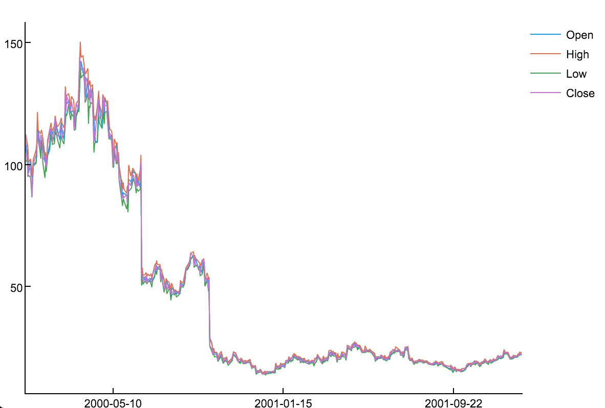
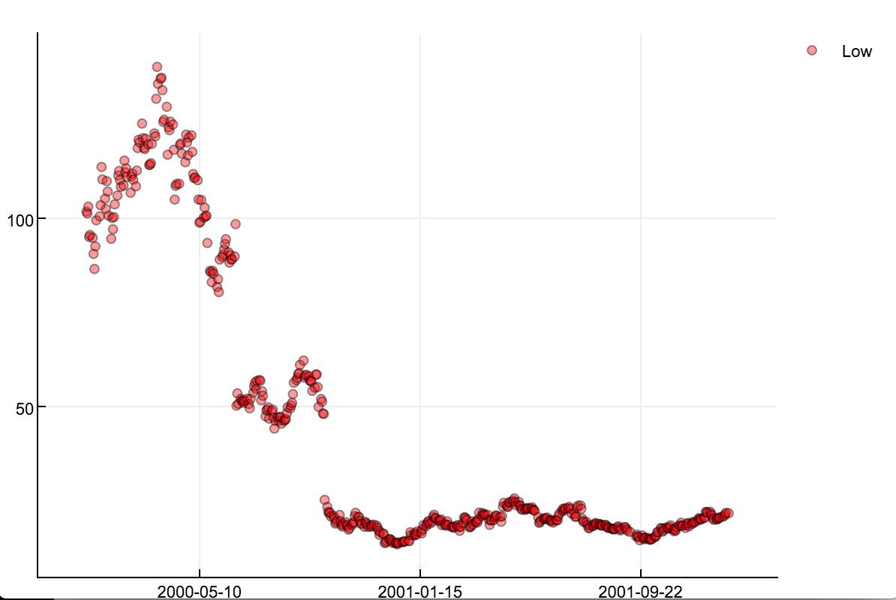

Plotting
===========

TimeSeries defines a recipe that allows plotting to a number of different plotting packages using the
`Plots.jl <https://github.com/JuliaPlots/Plots.jl>`_ framework (no plotting packages will be automatically installed by TimeSeries).

plot
-------------

The recipe allows TimeArray objects to be passed as input to ``plot``. The recipe will plot each variable as an individual
line, aligning all variables to the same y axis (here shown using PlotlyJS as a plotting backend).

::

    using Plots, MarketData, TimeSeries
    plotlyjs()
    plot(ohlc)

More sophisticated plots can be created by using keyword attributes and subsets::

    plot(MarketData.ohlc["Low"], seriestype = :scatter, markersize = 3, color = :red, markeralpha = 0.4, grid = true)

A complete list of all attributes and plotting possibilities can be found in the Plots `documentation <http://docs.juliaplots.org/latest/supported/>`_.
