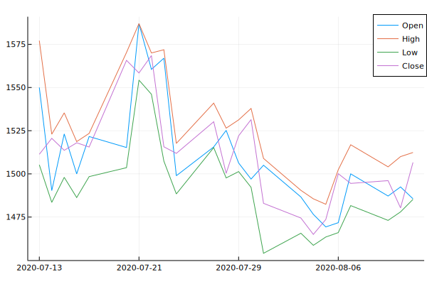
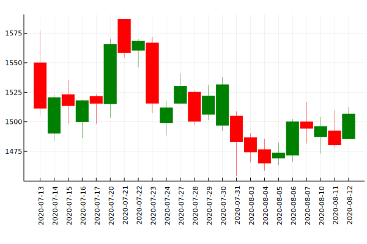
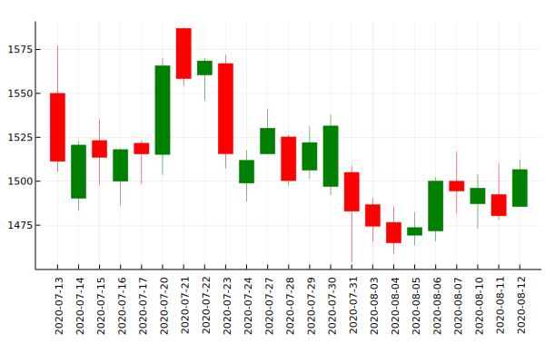
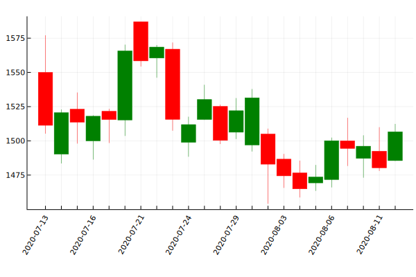

# Plotting

`TimeSeries` defines a recipe that allows plotting to a number of
different plotting packages using the
[Plots.jl](https://github.com/JuliaPlots/Plots.jl) framework
(no plotting packages will be automatically installed by `TimeSeries`).

Here we use the data from Yahoo Fiance as a demo.

```@example plot
using Plots, MarketData, TimeSeries
plotly()
ta = yahoo(:GOOG, YahooOpt(period1 = now() - Month(1)))
```

## Plotting as multiple series

The recipe allows `TimeArray` objects to be passed as input to `plot`. The
recipe will plot each variable as an individual line, aligning all
variables to the same y axis.
backend).

```@example plot
plot(ta[:Open, :High, :Low, :Close])
savefig("images/multi-series.svg"); nothing # hide
```




## Plotting candlestick

We have `seriestype = :candlestick` support that requires four columns exist in the input.
They are `open`, `high`, `low` and `close` (case-insensitive).

```@example plot
plot(ta, seriestype = :candlestick)
savefig("images/cs.svg"); nothing # hide
```




### Other available attributes

1. `bar_width::Float64` the valid value is from `0` to `1`.

```@example plot
plot(ta, seriestype = :candlestick, bar_width = 0.7)
savefig("images/bw.svg"); nothing # hide
```




2. `xticks::Int` for controlling the density of x axis labels.

```@example plot
plot(ta, seriestype = :candlestick, xticks = 3, xrotation = 60)
savefig("images/xticks.svg"); nothing # hide
```


